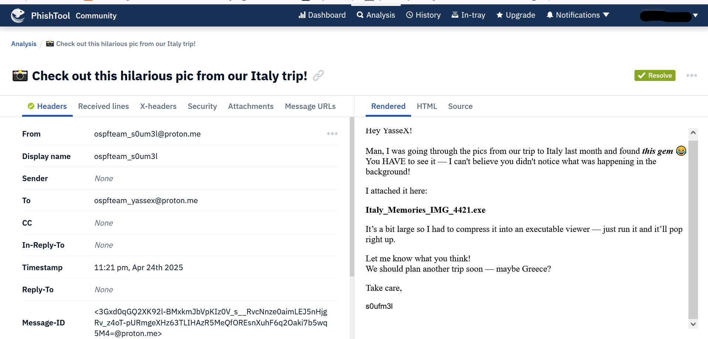
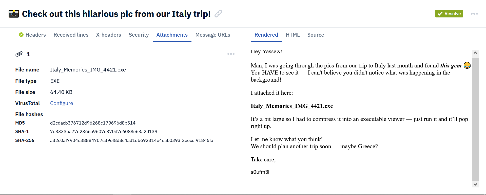
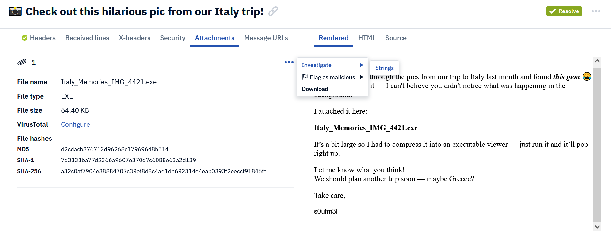
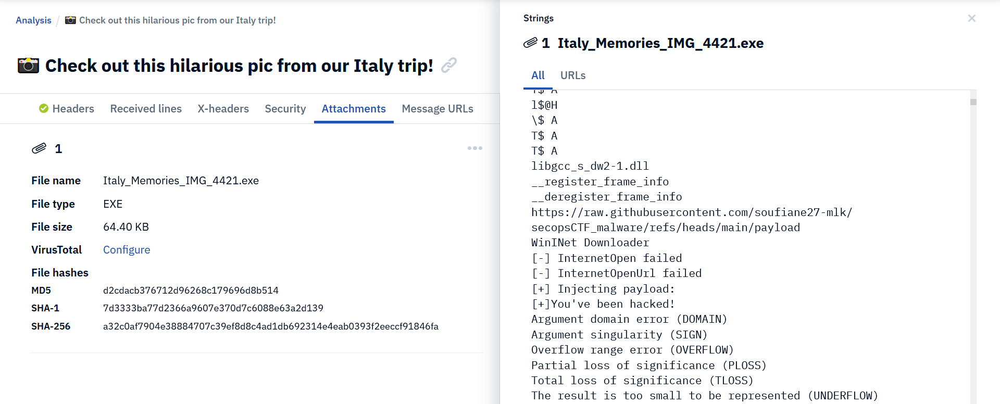
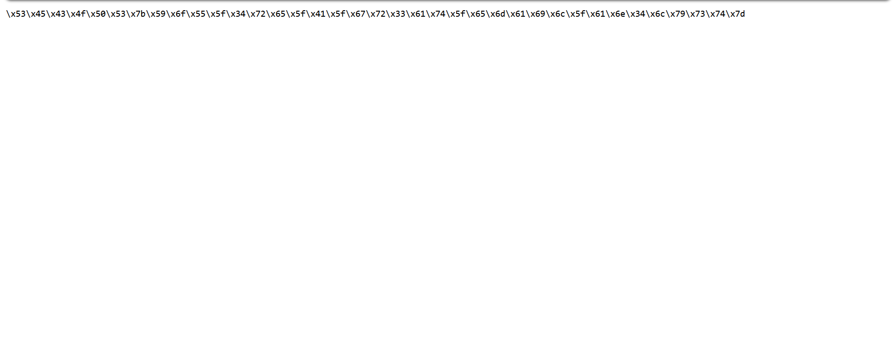

# 🛡️ Challenge Writeup — 📸
---

## 📜 Challenge Description

My friend always tries to infect me with malware. This time, he sent me an image, pretending it's a picture we took on our last trip to Italy.
Can you take a look at the email he sent and let me know what you find?

---

## 🔗 file Details

- file: `📸 Check out this hilarious pic from our Italy trip! 2025-04-24T23_21_14+01_00.eml`
 
> **Author:** s0ufm3l
---

## 🧠 Analysing

🎯 What is PhishTool?

PhishTool is a specialized platform designed to help security teams and analysts quickly and efficiently analyze, triage, and respond to suspicious emails — especially potential phishing attacks.

It provides a structured environment where you can load an email (such as .eml, .msg, or raw email text) and perform a deep analysis by automatically extracting key indicators like:

    URLs

    IP addresses

    Email headers

    Attachments

    Domains

PhishTool also highlights suspicious elements, checks for authentication issues (like SPF, DKIM, DMARC failures), and allows you to manually review artifacts, link them to threat intelligence feeds, and make a decision (benign, phishing, malware, etc.).

we load the email to phishtools:

We check the attachment and find that we have been sent an executable file named `Italy_Memories_IMG_4421.exe`. This is the suspicious part of the email and should be thoroughly investigated.

We can download the file and investigate it further, but PhishTool provides the ability to view the strings directly, which is all we need to solve this challenge.

We can see a link pointing to a GitHub page that we should visit.

The page contains a payload, but it is actually the flag.

> **flag:** SECOPS{YoU_4re_A_gr3at_email_an4lyst}