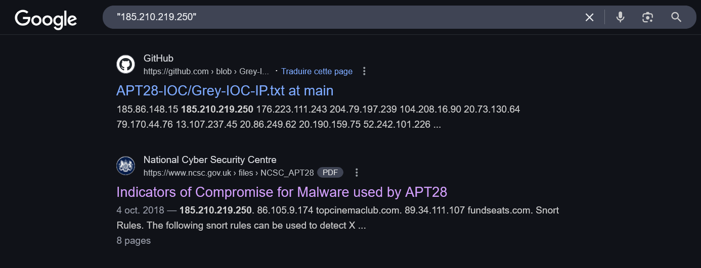
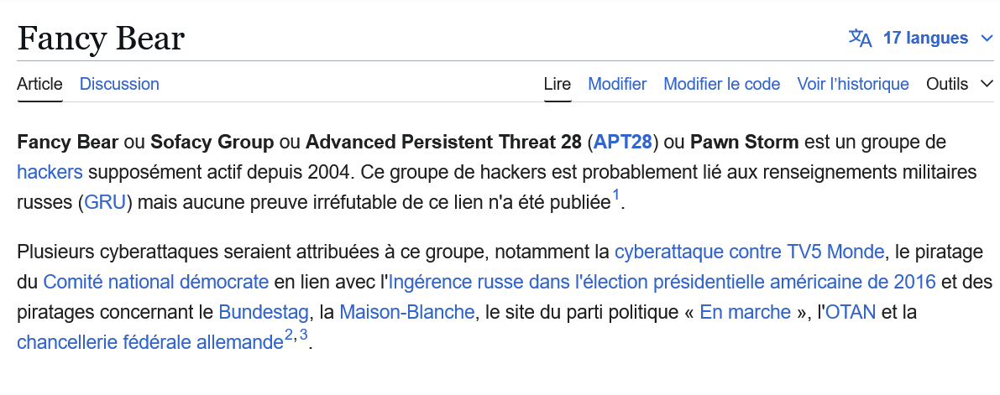

#Challenge Description

An alert just fired in your SOC!
The system detected communication with IP address 185.210.219.250, which is associated with a known threat actor's C2 infrastructure.

🕵️‍♂️ As the incident responder on call, your tasks are:

    Identify the APT group behind this IP address

    Find their alternative designation/name

    Determine their country of origin

    Identify when they first became active

    Determine the MITRE ATT&CK Technique ID for the initial access method used

📜 Flag format:
SECOPS{APTnumber_APTname_Country_Year_MITRETechniqueID}

✅ Example:
If the answers were APT99, Shadow Fox, Iran, 2007, and T1059, then the flag is:
SECOPS{APT99_Shadow_Fox_Iran_2007_T1059}

✍️ Author: YasseX

#🔎 Step 1: Investigating the IP Address

First, search the IP address on Google to identify the associated APT group.

IP address lookup

👉 From the search results, we find that the IP is linked to APT28.

#📚 Step 2: Gathering Information about APT28

Next, search for APT28 to collect the following details: alternative name, country, and first active year.

#Results:

    Alternative Designation: Fancy Bear

    Country of Origin: Russia

    First Active: 2004

#🎯 Step 3: Finding the MITRE ATT&CK Technique ID

APT28 is known for using Phishing as an initial access technique.
Using the MITRE ATT&CK framework, we find that the technique ID for phishing is T1566.

#🏁 Final Flag

Putting it all together:

SECOPS{APT28_Fancy_Bear_Russia_2004_T1566}
