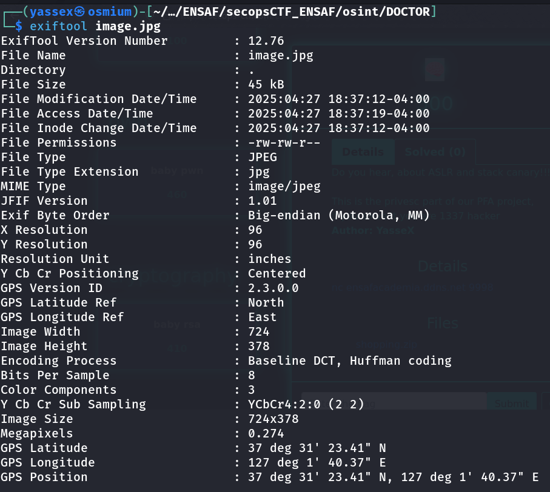
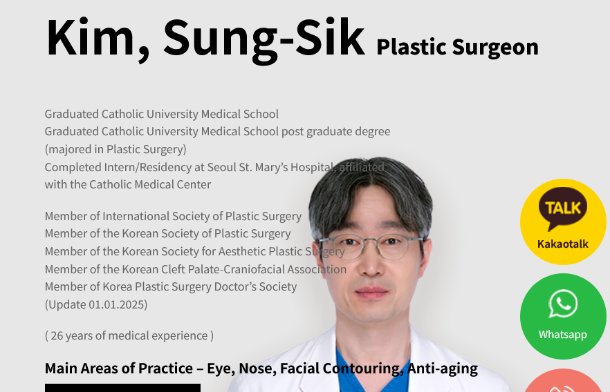

# Challenge Description

A close friend recently traveled to Asia for facial surgery.
He mentioned finding one of the best plastic surgeons, with 26 years of experience.

The only problem?
He forgot the doctor's name — but he sent me this photo from his visit.

📜 Flag format:
SECOPS{Doctor_Full_Name}

Example:
SECOPS{Kami_Soon-Hom}

✍️ Author: YasseX

# 🔎 Step 1: Extracting GPS Information

The first step is to use exiftool on the photo to extract metadata.
From the metadata, we find GPS coordinates embedded in the image.

# 🌍 Step 2: Investigating the Location

We search the GPS coordinates on Google Maps, which points us to a place in Asia.
After further investigation, we find a nearby clinic called "JK Surgery Clinic".

# Step 3: Finding the Doctor's Name

Next, by googling "JK Surgery Clinic doctors", we find the official website listing all the doctors.

We then look for the doctor who has 26 years of experience.
From the information provided, the doctor's full name is:

Kim Sung-Sik

# 🏁 Final Flag

SECOPS{Kim_Sung-Sik}
