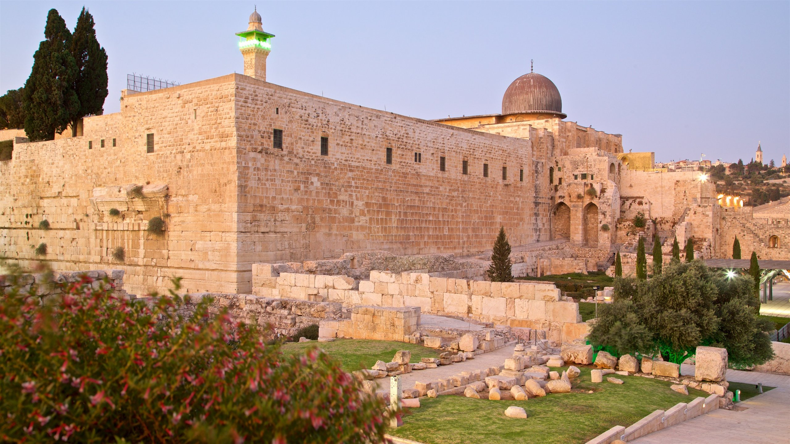

#🏙️ Challenge Description

🔍 Can you identify the city and the country from the picture?

Flag format:
SECOPS{City_Country}

📌 Example:
SECOPS{Al-Riyadh_Saudi_Arabia}

✍️ Author: YasseX
Here is the picture:

If we search using Google Image, we quickly find out that the location is Al-Quds!

#Final Flag:
SECOPS{Al-Quds_Palestine}
