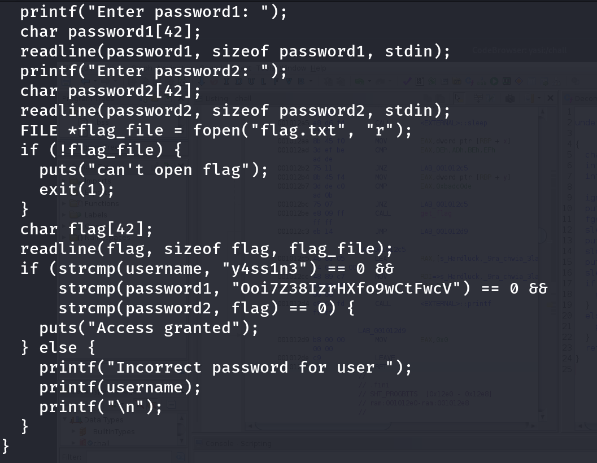
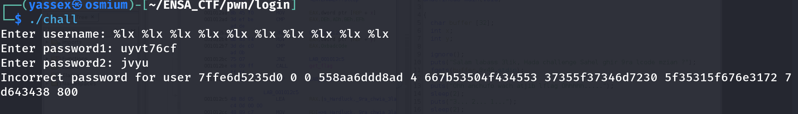
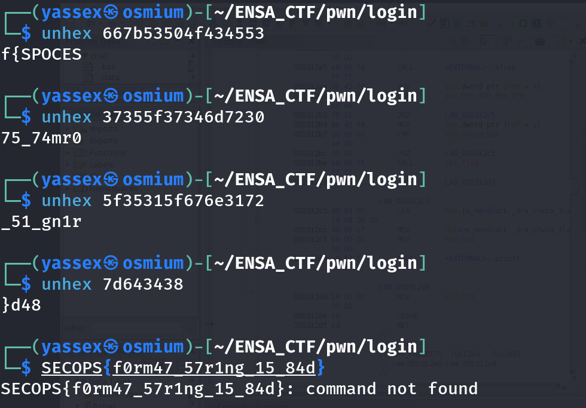

# Challenge Description

Can you log in!!
Author: YasseX

# Step 1: code review 

if we see the code we will notice that there is a format string vulnerability in that line 
**printf(username)**

# So we can leak data from the stack, and cuz the program read the flag before that we can leak the flag 

# Now we convert every 8 bytes to strings, NOTE that the hex is in little endian format

# Final flag : SECOPS{f0rm47_57r1ng_15_84d}
